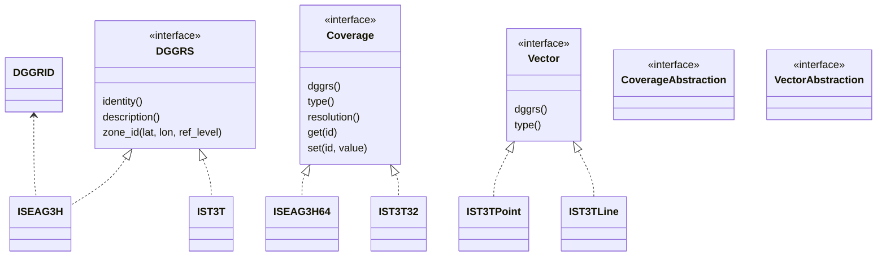

```mermaid
classDiagram

class DGGRS
<<interface>> DGGRS
DGGRS : identity()
DGGRS : description()
DGGRS : zone_id(lat, lon, ref_level)

DGGRS <|.. ISEAG3H
DGGRS <|.. IST3T
DGGRID <.. ISEAG3H

class Coverage
<<interface>> Coverage
Coverage : dggrs()
Coverage : type()
Coverage : resolution()
Coverage : get(id)
Coverage : set(id, value)

Coverage <|.. ISEAG3H64
Coverage <|.. IST3T32

class Vector
<<interface>> Vector
Vector : dggrs()
Vector : type()

Vector <|.. IST3TPoint
Vector <|.. IST3TLine

class CoverageAbstraction
<<interface>> CoverageAbstraction

class VectorAbstraction
<<interface>> VectorAbstraction
```
